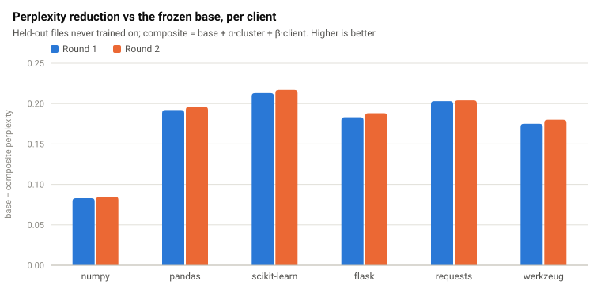
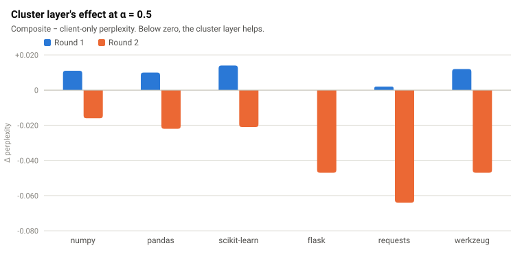
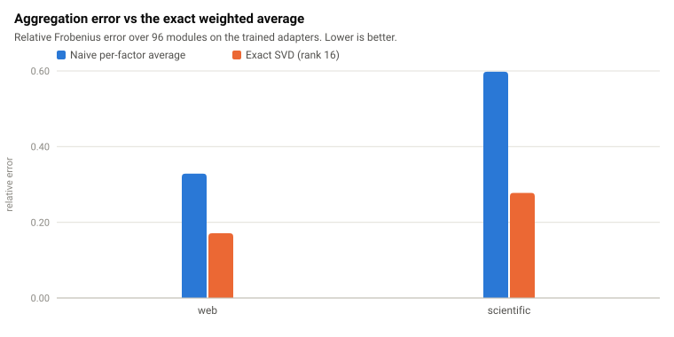
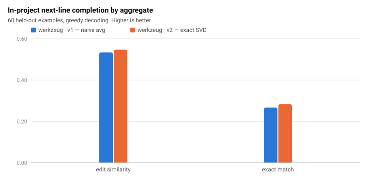
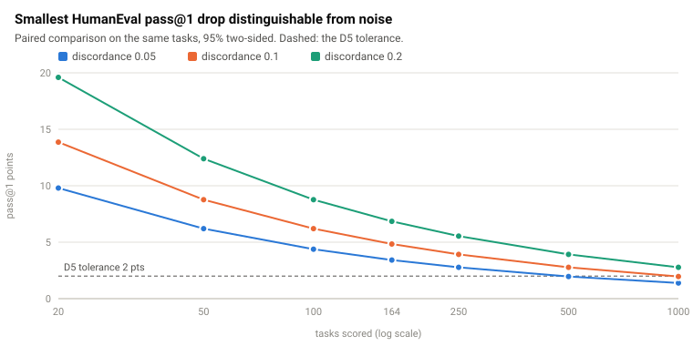

# Evaluation

This section reports how CLASP's personalized models were measured and what
the measurements show. Every number below is reproduced in
[`results_tables.md`](results_tables.md), and every table and figure is
regenerated from committed result files by the commands in §6.

## 1. Data

**D1 corpus.** Two domains of permissively licensed open-source Python:

| domain | projects | files | code lines | corpus sha256 |
|---|---|---|---|---|
| web / tooling | Click, Colorama, Flask, Jinja2, Requests, Werkzeug | 135 | 45,922 | `1d2d6f6e…` |
| scientific | NumPy, pandas, scikit-learn | 733 | 403,675 | `5901ae1a…` |

Collection pins each repository to a commit, applies one include/exclude glob
set, a minimum-code-lines and maximum-file-size filter and exact-content
deduplication (`reports/corpus_collection_report.md`).

**Partitioning.** One federated client per project (project-level
partitioning, seed 20260616); shards are disjoint by construction and checked
for overlap and balance (`reports/partition_validation_report.md`). The
federated rounds use two clusters of three clients: *web* = {flask, requests,
werkzeug} and *scientific* = {numpy, pandas, scikit-learn}.

**Held-out split.** A deterministic slice of each client's files is held out
and never trained on (for flask, 2 of 23 files). All personalization numbers
are measured on these files.

## 2. Metrics

| metric | what it answers | where it is used |
|---|---|---|
| held-out perplexity | does the model predict *this client's* code better? | personalization, α sweep |
| in-project next-line completion: edit similarity, exact match | does it *complete* this client's code better? (CodeXGLUE edit similarity: 1 − Levenshtein / max length) | D5 primary signal |
| HumanEval pass@1 | did general coding ability regress? | D5 guard |

Pass@k uses the unbiased estimator; candidate programs run in a subprocess
per program with a wall-clock timeout and POSIX resource limits. Sampling is
seeded per task (`generation.seed`), so a run is reproducible and independent
of task order.

## 3. Personalization



**Every client's model improves on its own held-out code in both rounds.**
Composite perplexity is below the frozen base on 6/6 clients, by a mean of
0.175 (round 1) and 0.178 (round 2); the smallest gain is numpy's (−0.083 /
−0.085), the largest scikit-learn's (−0.213 / −0.217).



**The cluster layer helps only when clients are trained in the D3 order.** In
round 1 the clients were trained on the bare base; the α sweep switched the
cluster layer off for all six, and forced to α = 0.5 it made every client
slightly worse (+0.000 to +0.014). In round 2 each client was trained on the
frozen base + 0.5·cluster (the registry's SVD cluster adapter, v2); the sweep
kept the cluster layer for all six and it lowered perplexity on every client
(−0.016 to −0.064). The round-2 composite beats round 1 on 6/6 clients. This
supports D3 as the condition for cross-client transfer: a client trained
without the cluster layer has already learned what the cluster would add.

## 4. Aggregation and in-project completion



Averaging LoRA factors A and B separately (the naive ablation) lands 1.9–2.2×
further from the exact weighted average of the client updates than the
truncated-SVD aggregate, on the trained adapters (relative Frobenius error
0.33 vs 0.17 for web, 0.60 vs 0.28 for scientific).



On in-project completion — the metric D5 decides on — the SVD aggregate also
scores higher than the naive one for the web cluster's representative client
(edit similarity 0.547 vs 0.534; exact match 0.283 vs 0.267, 60 held-out
examples, greedy decoding). §5 shows how much of that difference is
resolvable.

## 5. Measurement noise and the D5 guard



The base model scores pass@1 = 0.50 on the 20-task HumanEval subset (95%
bootstrap interval 0.30–0.70). D5 refuses a promotion if pass@1 drops by more
than 2 points. Because candidate and baseline are scored on the same tasks,
the noise in their difference comes only from tasks whose outcome flips; at a
plausible 10% flip rate the smallest drop distinguishable from noise is
**13.9 points at 20 tasks and still 4.8 points on all 164 HumanEval tasks**.
Resolving a 2-point drop would need on the order of 1,000 paired tasks.

Two consequences, both now in the pipeline:

* A guard drop above the tolerance but inside the noise floor is reported as
  `within_noise` — not evidence of a regression and not a pass — rather than
  silently acted on (`configs/guard_thresholds.yaml`).
* The in-project difference in §4 is one example in exact match (0.0167),
  below the exact-match noise floor at 60 paired examples (≈ 0.08). The
  edit-similarity band needs per-example scores from both versions; the
  bootstrap that computes it is implemented and waits on those rows.

## 6. Reproducing

From `services/evaluation/`:

```bash
python scripts/build_personalization_report.py   # results/personalization.json, reports/personalization_report.md
python scripts/build_noise_report.py             # results/noise_report.json,   reports/eval_noise_report.md
python scripts/export_lineage.py                 # results/lineage.json
python scripts/build_report_figures.py           # docs/report/figures/*.svg, docs/report/results_tables.md
```

The round manifests these read are copied verbatim from the edge lane
(`results/edge_rounds/`), and the HumanEval anchor is re-scored from the
committed samples by `scripts/score_humaneval_samples.py`.

## 7. Threats to validity

* **Model scale.** All rounds use the 1.3B `dev` profile on a 4 GB RTX 2050;
  the 6.7B target does not fit. Absolute numbers do not transfer to 6.7B.
* **Small held-out splits.** requests' held-out split is a single 513-token
  block; its per-client numbers are the noisiest.
* **Cluster includes the evaluated client.** Each cluster adapter aggregates
  all its members, including the client under evaluation — inherent to
  federated averaging. Held-out files were never trained on.
* **One seed.** Every round ran with seed 0. A training-seed noise band for
  in-project completion needs adapters trained with different seeds.
* **Guard not yet scored on a candidate.** The HumanEval guard is measured on
  the base model only, so every promotion decision so far is provisional.
* **Corpus deviation.** The web cluster on disk is {flask, requests,
  werkzeug}; the original D1 plan named {django, flask, requests}.
